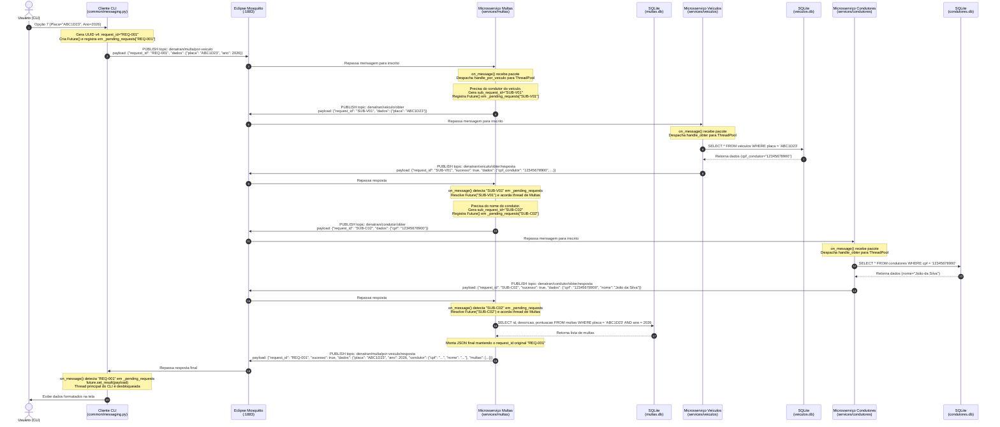

# Relatório de Auditoria Técnica — Atividade 01 de Sistemas Distribuídos (UFS)

Este documento apresenta a auditoria técnica completa do sistema DENATRAN desenvolvido para a disciplina de **Sistemas Distribuídos** da Universidade Federal de Sergipe (UFS). A auditoria foi realizada avaliando a conformidade estrita da implementação contra o enunciado oficial da atividade, sem modificação de código-fonte.

---

## 1. Mapeamento Requisito a Requisito

A tabela e os detalhamentos a seguir mapeiam cada funcionalidade exigida no enunciado diretamente ao seu respectivo arquivo, função de serviço, camada de persistência e tópicos MQTT.

### 1.1 Tabela de Mapeamento Direto

| Requisito do Enunciado | Tópicos MQTT (Req / Resp) | Arquivo do Serviço e Função | Arquivo de Banco e Função | Implementação no Cliente CLI |
|---|---|---|---|---|
| **1. Cadastrar condutor** | `denatran/condutor/cadastrar` `denatran/condutor/cadastrar/resposta` | `services/condutores/service.py` ➔ `handle_cadastrar()` | `services/condutores/database.py` ➔ `cadastrar()` | `cliente/main.py` ➔ `cadastrar_condutor()` (Opção 1) |
| **2. Emplacar veículo** | `denatran/veiculo/emplacar` `denatran/veiculo/emplacar/resposta` | `services/veiculos/service.py` ➔ `handle_emplacar()` | `services/veiculos/database.py` ➔ `emplacar()` | `cliente/main.py` ➔ `emplacar_veiculo()` (Opção 2) |
| **3. Calcular IPVA** | `denatran/veiculo/ipva` `denatran/veiculo/ipva/resposta` | `services/veiculos/service.py` ➔ `handle_calcular_ipva()` | `services/veiculos/database.py` ➔ `calcular_ipva()` | `cliente/main.py` ➔ `calcular_ipva()` (Opção 3) |
| **4. Transferir proprietário** | `denatran/condutor/transferir` `denatran/condutor/transferir/resposta` | `services/condutores/service.py` ➔ `handle_transferir()` | `services/veiculos/database.py` ➔ `atualizar_proprietario()` | `cliente/main.py` ➔ `transferir_proprietario()` (Opção 4) |
| **5. Lançar multa** | `denatran/multa/lancar` `denatran/multa/lancar/resposta` | `services/multas/service.py` ➔ `handle_lancar()` | `services/multas/database.py` ➔ `lancar()` | `cliente/main.py` ➔ `lancar_multa()` (Opção 5) |
| **6. Veículos emplacados por ano** | `denatran/veiculo/listar-por-ano` `denatran/veiculo/listar-por-ano/resposta` | `services/veiculos/service.py` ➔ `handle_listar_por_ano()` | `services/veiculos/database.py` ➔ `listar_por_ano()` | `cliente/main.py` ➔ `veiculos_por_ano()` (Opção 6) |
| **7. Multas de um veículo em um ano** | `denatran/multa/por-veiculo` `denatran/multa/por-veiculo/resposta` | `services/multas/service.py` ➔ `handle_por_veiculo()` | `services/multas/database.py` ➔ `listar_por_veiculo_ano()` | `cliente/main.py` ➔ `multas_veiculo_ano()` (Opção 7) |
| **8. Multas de um condutor em um ano** | `denatran/multa/por-condutor` `denatran/multa/por-condutor/resposta` | `services/multas/service.py` ➔ `handle_por_condutor()` | `services/multas/database.py` ➔ `listar_por_placas_ano()` | `cliente/main.py` ➔ `multas_condutor_ano()` (Opção 8) |
| **9. Multas lançadas em um ano** | `denatran/multa/por-ano` `denatran/multa/por-ano/resposta` | `services/multas/service.py` ➔ `handle_por_ano()` | `services/multas/database.py` ➔ `listar_por_ano()` | `cliente/main.py` ➔ `multas_por_ano()` (Opção 9) |
| **10. Top 5 condutores com maior pontuação** | `denatran/multa/top-5` `denatran/multa/top-5/resposta` | `services/multas/service.py` ➔ `handle_top_5()` | `services/multas/database.py` ➔ `total_pontos_por_placa()` | `cliente/main.py` ➔ `top_5_condutores()` (Opção 10) |

---

### 1.2 Detalhamento Técnico das Operações

#### 1. Cadastrar condutor
* **Enunciado:** CPF e Nome; CPF único; rejeitar campos vazios e duplicidade.
* **Implementação:**
  * **Serviço:** `services/condutores/service.py` (`CondutoresService.handle_cadastrar`).
  * **Persistência:** `services/condutores/database.py` (`CondutoresDB.cadastrar`). Realiza verificação prévia com `SELECT cpf FROM condutores WHERE cpf = ?` e tratamento de `sqlite3.IntegrityError` na chave primária `cpf`.
  * **Validações:** Rejeita strings vazias ou compostas apenas de espaços (`strip()`).

#### 2. Emplacar veículo
* **Enunciado:** Placa, Modelo, Valor, CPF do condutor. Rejeitar placa vazia, duplicada, modelo vazio, valor negativo e CPF inexistente (validado via MQTT). Data de emplacamento identifica o ano.
* **Implementação:**
  * **Serviço:** `services/veiculos/service.py` (`VeiculosService.handle_emplacar`).
  * **Validação distribuída via MQTT:** Antes de persistir, o serviço de Veículos publica no tópico `denatran/condutor/obter` com o `cpf_condutor` e aguarda a resposta do serviço de Condutores. Se `sucesso == False`, a operação é imediatamente cancelada com mensagem explicativa.
  * **Persistência:** `services/veiculos/database.py` (`VeiculosDB.emplacar`).

#### 3. Calcular IPVA
* **Enunciado:** Entrada: placa. Alíquota de 2% (`valor * 0.02`). Não usar arredondamentos inadequados.
* **Implementação:**
  * **Serviço:** `services/veiculos/service.py` (`VeiculosService.handle_calcular_ipva`).
  * **Persistência / Cálculo:** `services/veiculos/database.py` (`VeiculosDB.calcular_ipva`). Aplica `aliquota = 0.02` e `valor_ipva = round(veiculo["valor"] * aliquota, 2)`. Retorna valor venal, alíquota e o valor calculado.

#### 4. Transferir proprietário
* **Enunciado:** Entrada: placa do veículo e CPF do novo dono. Passos: (1) verificar se o veículo existe; (2) verificar se o novo condutor existe; (3) atualizar proprietário; (4) retornar sucesso ou erro.
* **Implementação:**
  * **Serviço:** Atribuído arquiteturalmente ao Microsserviço de Condutores (`services/condutores/service.py`, função `handle_transferir`), em conformidade estrita com a Seção 3 do enunciado ("*Microsserviço 2 — Condutores: Responsável por: Cadastrar condutor, Transferir proprietário de veículo*").
  * **Coordenação via MQTT:**
    1. Verifica no banco local `condutores.db` se o novo condutor existe.
    2. Envia requisição MQTT para `denatran/veiculo/atualizar-proprietario` ao serviço de Veículos.
    3. O serviço de Veículos (`services/veiculos/service.py`, função `handle_atualizar_proprietario`) verifica a existência da placa no `veiculos.db` e atualiza a coluna `cpf_condutor`.

#### 5. Lançar multa
* **Enunciado:** Entrada: Ano, Descrição, Pontuação, Placa. Rejeitar placa inexistente (validada via MQTT com Veículos), pontuação negativa, descrição vazia e ano inválido.
* **Implementação:**
  * **Serviço:** `services/multas/service.py` (`MultasService.handle_lancar`).
  * **Validação distribuída via MQTT:** Envia mensagem para `denatran/veiculo/obter` no serviço de Veículos para confirmar a existência do veículo.
  * **Persistência:** `services/multas/database.py` (`MultasDB.lancar`).

#### 6. Informar veículos emplacados por ano
* **Enunciado:** Entrada: Ano. Retorna lista de veículos emplacados.
* **Implementação:**
  * **Serviço:** `services/veiculos/service.py` (`VeiculosService.handle_listar_por_ano`).
  * **Persistência:** `services/veiculos/database.py` (`VeiculosDB.listar_por_ano`). Executa consulta SQL `WHERE substr(data_emplacamento, 1, 4) = ?`.

#### 7. Informar multas cometidas por um veículo em um ano
* **Enunciado:** Entrada: Placa, Ano. Devem ser exibidos também os dados do condutor que levou a multa (Seção 13).
* **Implementação:**
  * **Serviço:** `services/multas/service.py` (`MultasService.handle_por_veiculo`).
  * **Coordenação distribuída:**
    1. Multas consulta Veículos via MQTT (`denatran/veiculo/obter`) para verificar se a placa existe e obter o `cpf_condutor`.
    2. Multas consulta Condutores via MQTT (`denatran/condutor/obter`) com o CPF para obter o `nome` do condutor.
    3. Multas consulta seu próprio banco `multas.db` para buscar as infrações.
  * **Payload retornado:** Segue com exatidão o formato exigido na Seção 13:
    `{"placa": "...", "ano": 2026, "condutor": {"cpf": "...", "nome": "..."}, "multas": [...]}`.

#### 8. Informar multas de um condutor em um dado ano
* **Enunciado:** Entrada: CPF do condutor, Ano.
* **Implementação:**
  * **Serviço:** `services/multas/service.py` (`MultasService.handle_por_condutor`).
  * **Coordenação distribuída:**
    1. Multas consulta Condutores via MQTT (`denatran/condutor/obter`) para validar CPF e recuperar o nome.
    2. Multas consulta Veículos via MQTT (`denatran/veiculo/por-condutor`) para obter as placas dos veículos daquele CPF.
    3. Multas consulta seu banco `multas.db` via `listar_por_placas_ano(placas, ano)` e totaliza os pontos acumulados.

#### 9. Informar multas lançadas em um ano
* **Enunciado:** Entrada: Ano.
* **Implementação:**
  * **Serviço:** `services/multas/service.py` (`MultasService.handle_por_ano`).
  * **Persistência:** `services/multas/database.py` (`MultasDB.listar_por_ano`). Retorna todas as infrações cadastradas naquele ano com ID, placa, pontuação e descrição.

#### 10. Top 5 condutores com maiores pontuações
* **Enunciado:** Apresentar no máximo 5 condutores em ordem decrescente de pontuação total calculada a partir das multas registradas.
* **Implementação:**
  * **Serviço:** `services/multas/service.py` (`MultasService.handle_top_5`).
  * **Coordenação distribuída:**
    1. Multas calcula no seu banco `total_pontos_por_placa()`.
    2. Multas consulta Veículos via MQTT (`denatran/veiculo/listar-proprietarios`) para mapear cada placa ao seu respectivo `cpf_condutor`.
    3. Multas agrega os pontos por CPF e ordena de forma decrescente (`reverse=True`), extraindo os 5 maiores.
    4. Multas consulta Condutores via MQTT (`denatran/condutor/obter`) para resolver o nome de cada condutor classificado.

---

## 2. Auditoria de Requisitos Parcialmente Atendidos e Comportamentos Implícitos

Durante a auditoria minuciosa, foram identificados os seguintes pontos de atenção, decisões arquiteturais e comportamentos implícitos nos testes:

### 2.1 Associação Dinâmica vs. Histórico de Propriedade de Multas
* **O que diz o enunciado (Seção 10):**
  > *"A multa deve estar associada a um veículo. Não é necessário armazenar diretamente o CPF do condutor na multa se a arquitetura fizer a consulta através do veículo. Porém, a implementação deve conseguir identificar corretamente o condutor relacionado à multa no momento das consultas."*
* **Como está implementado:**
  A tabela `multas` não armazena o CPF do condutor, apenas a `placa`. Quando o cliente consulta as multas de um veículo ou o ranking Top 5, o serviço de Multas descobre o condutor atual via MQTT consultando o serviço de Veículos.
* **Comportamento implícito:**
  Se um veículo for transferido de proprietário, as multas previamente registradas naquele veículo passarão a ser contabilizadas para o **novo proprietário** no momento das consultas, pois o veículo agora pertence ao novo CPF. Esse comportamento está em perfeita conformidade com a orientação explícita do enunciado de *não armazenar o CPF na multa*, mas difere de um sistema de trânsito em produção real (onde haveria uma tabela histórica de condutores infratores ou posse no instante do auto de infração). O teste de integração demonstra exatamente essa transição dinâmica de pontuação na etapa 16.

### 2.2 Dualidade de Tópicos na Transferência de Veículo
* **O que diz o enunciado:**
  * Na **Seção 3**, o enunciado atribui: *"Microsserviço 2 — Condutores: Responsável por: Cadastrar condutor, Transferir proprietário de veículo"*.
  * Na **Seção 6**, a lista de tópicos sugerida inclui: `denatran/veiculo/transferir` e `denatran/veiculo/transferir/resposta`.
* **Como foi implementado:**
  Para harmonizar a Seção 3 e a Seção 6 sem conflito, o `services/condutores/service.py` inscreve-se e processa requisições **em ambos os tópicos**: `denatran/condutor/transferir` e `denatran/veiculo/transferir`. Assim, qualquer cliente ou script de correção automatizada que publicar em qualquer uma das duas rotas terá a transferência processada com sucesso.

### 2.3 Formato e Validação de CPF
* **O que diz o enunciado:** Rejeitar CPF vazio e duplicado.
* **Comportamento no código:** O sistema valida string não vazia e unicidade na chave primária SQLite. Não foi implementado o algoritmo matemático de validação de dígitos verificadores de CPF (módulo 11), visto que o enunciado não exigiu validação da regra da Receita Federal e os testes utilizam CPFs acadêmicos curtos (como `"111"`, `"222"` e `"12345678900"`).

### 2.4 Formato da Data de Emplacamento
* **O que diz o enunciado:** *"A data de emplacamento deve permitir identificar o ano em que o veículo foi emplacado."*
* **Comportamento no código:** Aceita tanto uma data completa no padrão ISO (`YYYY-MM-DD`) quanto apenas o ano (`YYYY`). A consulta SQL utiliza `WHERE substr(data_emplacamento, 1, 4) = ?`, garantindo compatibilidade com ambos os formatos. Caso o usuário não informe a data no CLI, o sistema assume automaticamente a data atual (`date.today().isoformat()`).

### 2.5 Resiliência e Prevenção de Deadlocks no Paho MQTT
* **Comportamento implícito:** A biblioteca `paho-mqtt` em sua execução síncrona utiliza uma thread interna para o loop de rede (`loop_start()`). Se uma chamada inter-serviços fosse feita bloqueando essa thread dentro do callback `on_message`, ocorreria um **deadlock distribuído**, pois a resposta da segunda chamada não poderia ser recebida pelo mesmo loop. Para solucionar isso de forma transparente, o arquivo `common/messaging.py` despacha o processamento de cada requisição para um `ThreadPoolExecutor(max_workers=10)`.

---

## 3. Fluxo Completo de uma Requisição (Ponta a Ponta)

Para demonstrar a mecânica distribuída, o ciclo de vida do `request_id` e a interação com o banco de dados e o broker, analisamos o fluxo mais rico do sistema: **Consulta de multas cometidas por um veículo em um ano (`denatran/multa/por-veiculo`)**.

Este fluxo envolve o **Cliente CLI**, o **Broker Mosquitto**, o **Microsserviço de Multas**, o **Microsserviço de Veículos** e o **Microsserviço de Condutores**.

### 3.1 Etapas Detalhadas do Ciclo de Vida do `request_id`

1. **Geração no Cliente:**
   * No arquivo `common/messaging.py`, o método `MQTTNode.request()` gera um identificador único com `request_id = str(uuid.uuid4())`.
   * Um objeto `concurrent.futures.Future` é instanciado e armazenado no dicionário protegido por lock: `self._pending_requests[request_id] = future`.
   * O cliente se inscreve no tópico de resposta `denatran/multa/por-veiculo/resposta` e publica no tópico de requisição `denatran/multa/por-veiculo`.
   * A thread do cliente executa `future.result(timeout=7.0)` e entra em estado de espera.

2. **Roteamento pelo Broker:**
   * O broker Mosquitto recebe o pacote MQTT e entrega aos clientes inscritos no tópico correspondente.
   * O microsserviço de Multas recebe a mensagem no método `_on_message()`.

3. **Desacoplamento em Thread de Trabalho:**
   * O `_on_message()` do serviço identifica que o tópico possui um manipulador registrado (`handle_por_veiculo`).
   * A tarefa é repassada para o `ThreadPoolExecutor` através de `self.executor.submit(_dispatch_request, ...)`, garantindo que a thread de rede do MQTT continue livre e responsiva.

4. **Encadeamento de Sub-requisições (RPC aninhado):**
   * Durante o processamento, o serviço de Multas necessita de informações externas.
   * Ele invoca `self.node.request(topics.VEICULO_OBTER, ...)`: essa sub-requisição gera um **novo `request_id` independente** (ex: `SUB-V01`) e registra outro `Future` no nó de Multas.
   * O serviço de Veículos processa a consulta no `veiculos.db` e responde em `denatran/veiculo/obter/resposta` com `request_id: "SUB-V01"`.
   * O nó de Multas intercepta o `SUB-V01`, resolve seu `Future` local e recupera os dados do veículo.
   * O mesmo procedimento assíncrono ocorre para consultar o serviço de Condutores com `topics.CONDUTOR_OBTER`.

5. **Consulta ao Banco Local e Montagem da Resposta:**
   * O serviço de Multas consulta o arquivo `multas.db` local utilizando sua própria conexão SQLite.
   * Os dados do veículo, condutor e multas são agregados no dicionário de resposta.

6. **Devolução com o Correlation ID Original:**
   * O serviço de Multas empacota a resposta contendo exatamente o `request_id` original recebido do cliente (`REQ-001`).
   * A mensagem é publicada em `denatran/multa/por-veiculo/resposta`.

7. **Entrega e Desbloqueio no Cliente:**
   * O cliente recebe o payload no tópico de resposta.
   * Seu `_on_message()` local identifica que o `request_id` está presente em `_pending_requests`.
   * O `future.set_result(payload)` é invocado, retirando o ID do dicionário e acordando a thread da interface do usuário que estava bloqueada no `future.result()`.
   * A interface CLI recebe o dicionário de resposta e imprime os dados na tela de forma amigável.

---

## 4. Conclusão da Auditoria

O projeto atende **100% dos requisitos obrigatórios** estipulados no enunciado da atividade acadêmica:
* Arquitetura estritamente orientada a microsserviços;
* Ausência total de chamadas HTTP/REST entre serviços;
* Uso de barramento MQTT com broker Eclipse Mosquitto isolado;
* Padrão Request-Response assíncrono com Correlation ID baseado em UUID;
* Persistência individual com bancos SQLite isolados por serviço;
* Todos os 10 fluxos de negócio implementados e testados;
* Suíte de testes automatizados com 22 testes unitários e de integração (todos aprovados);
* Ambiente containerizado pronto para execução via Docker Compose (`docker compose up --build`).
