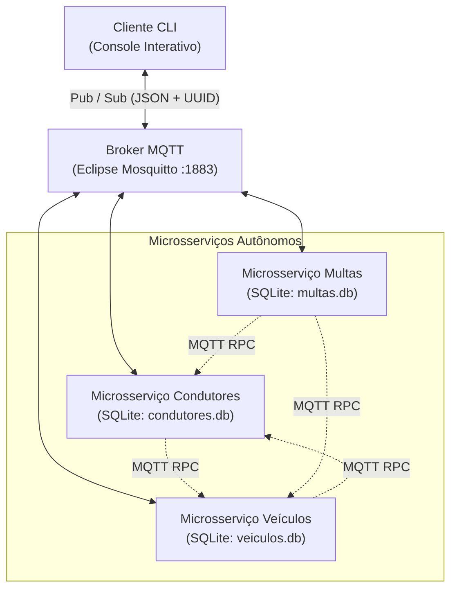

# DENATRAN — Sistema Distribuído com Microsserviços e MQTT

**Atividade 01 de Sistemas Distribuídos**  
**Universidade Federal de Sergipe (UFS)**  
**Autor:** Gustavo Henrique Marques

---

## 1. Objetivo

O objetivo deste projeto é implementar o sistema de TI do **DENATRAN** para gerenciamento de veículos, condutores e infrações em âmbito nacional. O sistema adota uma arquitetura baseada em **microsserviços independentes**, comunicando-se exclusivamente através do protocolo **MQTT** no modelo **Publish/Subscribe (Pub/Sub)**, com persistência isolada em **SQLite** e empacotamento completo via **Docker e Docker Compose**.

---

## 2. Tecnologias Utilizadas

* **Linguagem:** Python 3.12 / 3.13
* **Protocolo de Comunicação:** MQTT (Message Queuing Telemetry Transport) v3.1.1 / v5.0
* **Broker MQTT:** Eclipse Mosquitto 2.0 (em container dedicado)
* **Biblioteca Cliente MQTT:** `paho-mqtt` 2.x
* **Formato de Mensagens:** JSON
* **Persistência de Dados:** SQLite 3 (banco de dados isolado por microsserviço)
* **Conteinerização e Orquestração:** Docker e Docker Compose
* **Framework de Testes:** Pytest

---

## 3. Arquitetura

O sistema é composto por 3 microsserviços de backend, 1 broker central de mensageria e 1 cliente CLI:



### Princípios Arquiteturais Obrigatórios
1. **Comunicação estritamente via MQTT:** Nenhuma chamada HTTP/REST/RPC direta ou framework web (Flask, FastAPI, etc.) é utilizada. O broker MQTT atua como barramento de eventos e mensagens corporativo.
2. **Isolamento de Banco de Dados (*Database-per-Service*):** Cada microsserviço gerencia exclusivamente o seu próprio arquivo SQLite (`condutores.db`, `veiculos.db` e `multas.db`). Nenhum microsserviço acessa direta ou indiretamente as tabelas de outro serviço.
3. **Padrão Request-Response Assíncrono com Correlation ID:** Cada requisição gera um identificador único `request_id` (UUID v4). As respostas devolvem o mesmo `request_id`, permitindo correlação precisa e não-bloqueante no modelo Pub/Sub.
4. **Execução Desacoplada (ThreadPool):** O processamento de mensagens recebidas nos microsserviços ocorre em pools de threads (`ThreadPoolExecutor`), garantindo que chamadas síncronas entre serviços (ex: Multas consultando Veículos) nunca travem o loop de rede do cliente MQTT.

---

## 4. Estrutura do Projeto

```text
.
├── docker-compose.yml          # Orquestração de todos os containers (broker, serviços, cliente)
├── README.md                   # Documentação completa e instruções de execução
├── .gitignore                  # Arquivos ignorados pelo controle de versão
│
├── mosquitto/                  # Configuração do broker MQTT
│   └── mosquitto.conf
│
├── common/                     # Código compartilhado entre serviços e cliente
│   ├── __init__.py
│   ├── config.py               # Variáveis de ambiente e configurações globais
│   ├── logger.py               # Configuração padronizada de logs com tags [SERVICO]
│   ├── messaging.py            # Nó MQTT com suporte a RPC assíncrono, timeout e Correlation ID
│   └── topics.py               # Constantes com todos os tópicos MQTT do sistema
│
├── services/                   # Microsserviços
│   ├── condutores/             # Microsserviço 1: Condutores
│   │   ├── Dockerfile
│   │   ├── requirements.txt
│   │   ├── database.py         # Persistência SQLite (condutores.db)
│   │   ├── service.py          # Lógica de negócio e handlers MQTT
│   │   ├── main.py             # Ponto de entrada do serviço
│   │   └── data/               # Diretório do banco de dados SQLite
│   │
│   ├── veiculos/               # Microsserviço 2: Veículos
│   │   ├── Dockerfile
│   │   ├── requirements.txt
│   │   ├── database.py         # Persistência SQLite (veiculos.db)
│   │   ├── service.py          # Lógica de negócio, cálculo de IPVA e validação de condutor via MQTT
│   │   ├── main.py             # Ponto de entrada do serviço
│   │   └── data/               # Diretório do banco de dados SQLite
│   │
│   └── multas/                 # Microsserviço 3: Multas
│       ├── Dockerfile
│       ├── requirements.txt
│       ├── database.py         # Persistência SQLite (multas.db)
│       ├── service.py          # Lógica de negócio, validação e agregação de condutores via MQTT
│       ├── main.py             # Ponto de entrada do serviço
│       └── data/               # Diretório do banco de dados SQLite
│
├── cliente/                    # Aplicação Cliente CLI
│   ├── Dockerfile
│   ├── requirements.txt
│   ├── main.py                 # Interface interativa de terminal e modo demonstração (--demo)
│   └── ...
│
└── tests/                      # Bateria de testes automatizados
    ├── __init__.py
    ├── conftest.py             # Fixtures para bancos de dados temporários e limpeza
    ├── test_condutores.py      # Testes unitários do microsserviço de condutores
    ├── test_veiculos.py        # Testes unitários do microsserviço de veículos
    ├── test_multas.py          # Testes unitários do microsserviço de multas
    └── test_integration.py     # Teste de integração E2E com broker MQTT ativo
```

---

## 5. Tabela de Tópicos MQTT

| Operação | Tópico de Requisição | Tópico de Resposta | Microsserviço Responsável | Comunicação Inter-serviços |
|---|---|---|---|---|
| **Cadastrar condutor** | `denatran/condutor/cadastrar` | `denatran/condutor/cadastrar/resposta` | Condutores | Nenhuma |
| **Obter condutor** | `denatran/condutor/obter` | `denatran/condutor/obter/resposta` | Condutores | Nenhuma (chamado por Veículos e Multas) |
| **Listar condutores** | `denatran/condutor/listar` | `denatran/condutor/listar/resposta` | Condutores | Nenhuma |
| **Transferir proprietário** | `denatran/condutor/transferir` ou `denatran/veiculo/transferir` | `.../resposta` | Condutores | Condutores ➔ Veículos (`denatran/veiculo/atualizar-proprietario`) |
| **Emplacar veículo** | `denatran/veiculo/emplacar` | `denatran/veiculo/emplacar/resposta` | Veículos | Veículos ➔ Condutores (`denatran/condutor/obter`) |
| **Calcular IPVA** | `denatran/veiculo/ipva` | `denatran/veiculo/ipva/resposta` | Veículos | Nenhuma |
| **Listar veículos por ano** | `denatran/veiculo/listar-por-ano` | `denatran/veiculo/listar-por-ano/resposta` | Veículos | Nenhuma |
| **Obter veículo** | `denatran/veiculo/obter` | `denatran/veiculo/obter/resposta` | Veículos | Nenhuma (chamado por Multas) |
| **Listar veículos de um condutor**| `denatran/veiculo/por-condutor` | `denatran/veiculo/por-condutor/resposta` | Veículos | Nenhuma (chamado por Multas) |
| **Listar proprietários de veículos**| `denatran/veiculo/listar-proprietarios` | `denatran/veiculo/listar-proprietarios/resposta` | Veículos | Nenhuma (chamado por Multas no Top 5) |
| **Atualizar proprietário** | `denatran/veiculo/atualizar-proprietario`| `denatran/veiculo/atualizar-proprietario/resposta`| Veículos | Nenhuma |
| **Lançar multa** | `denatran/multa/lancar` | `denatran/multa/lancar/resposta` | Multas | Multas ➔ Veículos (`denatran/veiculo/obter`) |
| **Multas de um veículo no ano** | `denatran/multa/por-veiculo` | `denatran/multa/por-veiculo/resposta` | Multas | Multas ➔ Veículos (`obter`) ➔ Condutores (`obter`) |
| **Multas de um condutor no ano**| `denatran/multa/por-condutor` | `denatran/multa/por-condutor/resposta` | Multas | Multas ➔ Condutores (`obter`) + Veículos (`por-condutor`) |
| **Multas lançadas no ano** | `denatran/multa/por-ano` | `denatran/multa/por-ano/resposta` | Multas | Nenhuma |
| **Top 5 condutores com multas**| `denatran/multa/top-5` | `denatran/multa/top-5/resposta` | Multas | Multas ➔ Veículos (`listar-proprietarios`) ➔ Condutores (`obter`) |

---

## 6. Como Executar

### Pré-requisitos
* **Docker** e **Docker Compose** instalados na máquina.

### Passo 1: Construir e iniciar os containers de infraestrutura e microsserviços
Na raiz do projeto, execute:

```bash
docker compose up --build -d mqtt condutores veiculos multas
```

Para verificar o status dos containers:
```bash
docker compose ps
```

Para visualizar os logs em tempo real dos microsserviços:
```bash
docker compose logs -f
```

---

### Passo 2: Executar o Cliente CLI Interativo
Para interagir com o sistema através do menu de linha de comando:

```bash
docker compose run --rm cliente
```

Você verá a tela principal:
```text
========================================
        DENATRAN - SISTEMA
========================================
1  - Cadastrar condutor
2  - Emplacar veículo
3  - Calcular IPVA
4  - Transferir proprietário
5  - Lançar multa
6  - Veículos emplacados por ano
7  - Multas de um veículo
8  - Multas de um condutor
9  - Multas lançadas em um ano
10 - Top 5 condutores
0  - Sair
========================================
Escolha uma opção:
```

### Demonstração Automatizada (Opcional)
Para executar uma demonstração automática com todas as 10 operações sequenciais em apenas 3 segundos:

```bash
docker compose run --rm cliente python cliente/main.py --demo
```

---

## 7. Como Executar os Testes

O projeto contém testes unitários e de integração de ponta a ponta.

### Opção A: Executar os testes via Docker (Recomendado, não exige Python na máquina host)
Com os microsserviços ativos no Docker Compose:

```bash
docker compose run --rm cliente pytest
```

### Opção B: Executar os testes localmente com Python nativo
Caso tenha Python 3.12+ e pytest instalados localmente e o broker Mosquitto ativo na porta 1883:

```bash
python -m pytest -v
```

---

## 8. Exemplos Detalhados de Uso das Funcionalidades

### 1. Cadastrar Condutor
* **Entrada:**
  * CPF: `12345678900`
  * Nome: `João da Silva`
* **Resposta MQTT:**
  ```json
  {
    "request_id": "90e0c8b5-31a8-4bb9-bdff-83f9dd4eb16c",
    "sucesso": true,
    "mensagem": "Condutor cadastrado com sucesso.",
    "dados": {
      "cpf": "12345678900",
      "nome": "João da Silva",
      "criado_em": "2026-10-03T16:51:43.012345"
    }
  }
  ```

---

### 2. Emplacar Veículo
Valida via MQTT com o serviço de Condutores se o condutor informado existe. Se não existir, a operação é rejeitada.
* **Entrada:**
  * Placa: `ABC1D23`
  * Modelo: `Fiat Uno`
  * Valor: `50000.00`
  * CPF do condutor: `12345678900`
  * Data de emplacamento: `2026-03-15`
* **Resposta MQTT:**
  ```json
  {
    "request_id": "4002faba-b69e-4037-8b0e-46a75f23cf42",
    "sucesso": true,
    "mensagem": "Veículo emplacado com sucesso.",
    "dados": {
      "placa": "ABC1D23",
      "modelo": "Fiat Uno",
      "valor": 50000.0,
      "cpf_condutor": "12345678900",
      "data_emplacamento": "2026-03-15"
    }
  }
  ```

---

### 3. Calcular IPVA do Veículo
Aplica a alíquota exata de 2% sobre o valor venal cadastrado.
* **Entrada:**
  * Placa: `ABC1D23`
* **Resposta MQTT:**
  ```json
  {
    "request_id": "c8db280c-6b4e-422a-be5a-db7dfdc756e0",
    "sucesso": true,
    "mensagem": "IPVA calculado com sucesso.",
    "dados": {
      "placa": "ABC1D23",
      "modelo": "Fiat Uno",
      "valor_veiculo": 50000.0,
      "aliquota": 0.02,
      "aliquota_percentual": "2%",
      "valor_ipva": 1000.0
    }
  }
  ```

---

### 4. Transferir Proprietário
Coordena a transferência via MQTT: Condutores valida novo dono e instrui Veículos a atualizar o registro.
* **Entrada:**
  * Placa: `ABC1D23`
  * CPF do novo proprietário: `98765432100` (Maria Santos)
* **Resposta MQTT:**
  ```json
  {
    "request_id": "bc72930c-381e-454c-933f-55f9743b392b",
    "sucesso": true,
    "mensagem": "Proprietário do veículo ABC1D23 transferido com sucesso para Maria Santos (CPF: 98765432100).",
    "dados": {
      "placa": "ABC1D23",
      "modelo": "Fiat Uno",
      "cpf_condutor": "98765432100"
    }
  }
  ```

---

### 5. Lançar Multa
Valida via MQTT com o serviço de Veículos se o veículo existe. Se inexistente, rejeita o lançamento.
* **Entrada:**
  * Placa: `ABC1D23`
  * Ano: `2026`
  * Descrição: `Excesso de velocidade`
  * Pontuação: `5`
* **Resposta MQTT:**
  ```json
  {
    "request_id": "f0a6f21e-2539-4b5b-969a-9f807a8e2072",
    "sucesso": true,
    "mensagem": "Multa lançada com sucesso.",
    "dados": {
      "id": 1,
      "ano": 2026,
      "descricao": "Excesso de velocidade",
      "pontuacao": 5,
      "placa": "ABC1D23",
      "criado_em": "2026-10-03T16:51:43.456789"
    }
  }
  ```

---

### 6. Informar Veículos Emplacados por Ano
* **Entrada:**
  * Ano: `2026`
* **Resposta MQTT:**
  ```json
  {
    "request_id": "65a50905-3c4b-4e38-aea8-f09823a26d58",
    "sucesso": true,
    "mensagem": "2 veículo(s) encontrado(s) emplacado(s) em 2026.",
    "dados": [
      {
        "placa": "ABC1D23",
        "modelo": "Fiat Uno",
        "valor": 50000.0,
        "cpf_condutor": "12345678900",
        "data_emplacamento": "2026-03-15"
      },
      {
        "placa": "XYZ9999",
        "modelo": "VW Gol",
        "valor": 60000.0,
        "cpf_condutor": "98765432100",
        "data_emplacamento": "2026-06-20"
      }
    ]
  }
  ```

---

### 7. Informar Multas de um Veículo em um Ano (com dados do condutor)
Conforme exigido na Seção 13, recupera as infrações e os dados cadastrais do condutor responsável via MQTT.
* **Entrada:**
  * Placa: `ABC1D23`
  * Ano: `2026`
* **Resposta MQTT:**
  ```json
  {
    "request_id": "7f684436-215f-471e-9597-377f04b55913",
    "sucesso": true,
    "mensagem": "2 multa(s) localizada(s) para o veículo ABC1D23 em 2026.",
    "dados": {
      "placa": "ABC1D23",
      "ano": 2026,
      "condutor": {
        "cpf": "12345678900",
        "nome": "João da Silva"
      },
      "multas": [
        {
          "id": 1,
          "descricao": "Excesso de velocidade",
          "pontuacao": 5
        },
        {
          "id": 2,
          "descricao": "Avanço de sinal vermelho",
          "pontuacao": 7
        }
      ]
    }
  }
  ```

---

### 8. Informar Multas de um Condutor em um Ano
Consulta o condutor, localiza todos os veículos a ele associados e totaliza as multas e pontos acumulados.
* **Entrada:**
  * CPF: `12345678900`
  * Ano: `2026`
* **Resposta MQTT:**
  ```json
  {
    "request_id": "935517be-b7a7-4e73-b56d-1dc7b9c7c77a",
    "sucesso": true,
    "mensagem": "2 multa(s) localizada(s) para o condutor João da Silva em 2026 (Total: 12 pts).",
    "dados": {
      "cpf": "12345678900",
      "nome": "João da Silva",
      "ano": 2026,
      "veiculos": ["ABC1D23"],
      "total_pontos": 12,
      "total_multas": 2,
      "multas": [
        {
          "id": 1,
          "ano": 2026,
          "descricao": "Excesso de velocidade",
          "pontuacao": 5,
          "placa": "ABC1D23",
          "criado_em": "..."
        },
        {
          "id": 2,
          "ano": 2026,
          "descricao": "Avanço de sinal vermelho",
          "pontuacao": 7,
          "placa": "ABC1D23",
          "criado_em": "..."
        }
      ]
    }
  }
  ```

---

### 9. Informar Multas Lançadas em um Ano
* **Entrada:**
  * Ano: `2026`
* **Resposta MQTT:**
  ```json
  {
    "request_id": "030ad6d9-ddb1-4d07-b0e0-634c49ae2423",
    "sucesso": true,
    "mensagem": "3 multa(s) lançada(s) no ano 2026.",
    "dados": {
      "ano": 2026,
      "total_multas": 3,
      "multas": [
        {"id": 1, "ano": 2026, "descricao": "Excesso de velocidade", "pontuacao": 5, "placa": "ABC1D23", "criado_em": "..."},
        {"id": 2, "ano": 2026, "descricao": "Avanço de sinal vermelho", "pontuacao": 7, "placa": "ABC1D23", "criado_em": "..."},
        {"id": 3, "ano": 2026, "descricao": "Estacionar em vaga especial", "pontuacao": 4, "placa": "XYZ9999", "criado_em": "..."}
      ]
    }
  }
  ```

---

### 10. Top 5 Condutores com Maior Pontuação
Agrega as multas registradas por veículo, associa dinamicamente aos condutores proprietários via MQTT, ordena de forma decrescente e consulta o nome de cada um no serviço de Condutores.
* **Entrada:** Nenhuma (consulta global)
* **Resposta MQTT:**
  ```json
  {
    "request_id": "fd5580e5-800c-4d10-b7cc-9ec5c9bf9045",
    "sucesso": true,
    "mensagem": "Top 5 condutores com maiores pontuações obtido com sucesso.",
    "dados": [
      {
        "posicao": 1,
        "cpf": "98765432100",
        "nome": "Maria Santos",
        "pontuacao_total": 16
      },
      {
        "posicao": 2,
        "cpf": "12345678900",
        "nome": "João da Silva",
        "pontuacao_total": 12
      }
    ]
  }
  ```

---

## 9. Checklist de Requisitos Atendidos

Conforme o critério principal estipulado no enunciado, segue a revisão detalhada requisito a requisito:

| Requisito do Enunciado | Implementado | Testado | Detalhes da Implementação |
|---|:---:|:---:|---|
| **Emplacar veículo** | ✓ | ✓ | Registra placa, modelo, valor, condutor e data; valida existência do condutor via MQTT. |
| **Calcular IPVA** | ✓ | ✓ | Alíquota de 2% aplicada sem arredondamentos indevidos; retorna valor venal e IPVA. |
| **Transferir proprietário** | ✓ | ✓ | Verifica se o veículo e o novo condutor existem via MQTT e atualiza o proprietário. |
| **Cadastrar condutor** | ✓ | ✓ | Valida CPF não vazio, CPF único e nome não vazio no banco isolado de condutores. |
| **Lançar multa** | ✓ | ✓ | Valida se o veículo existe via MQTT; valida pontuação não-negativa e ano válido. |
| **Veículos por ano** | ✓ | ✓ | Filtra pelo ano de emplacamento do veículo no banco de dados de veículos. |
| **Multas de veículo por ano** | ✓ | ✓ | Retorna multas e enriquece a resposta com os dados cadastrais do condutor via MQTT. |
| **Multas de condutor por ano** | ✓ | ✓ | Busca veículos do condutor via MQTT e totaliza multas e pontos acumulados. |
| **Multas lançadas por ano** | ✓ | ✓ | Lista todas as multas cadastradas no ano informado. |
| **Top 5 condutores** | ✓ | ✓ | Agregação por veículo ➔ condutor via MQTT, ordenação decrescente por pontuação total. |
| **Comunicação MQTT** | ✓ | ✓ | 100% via Eclipse Mosquitto no padrão Pub/Sub com JSON e Correlation ID (UUID). |
| **Microsserviços** | ✓ | ✓ | 3 microsserviços autônomos (`condutores`, `veiculos`, `multas`) com bancos SQLite isolados. |
| **Docker & Docker Compose** | ✓ | ✓ | `docker compose up --build` sobe broker, microsserviços e cliente na rede `denatran-net`. |
| **Cliente CLI** | ✓ | ✓ | Interface interativa de console com menu 1-10 + 0 Sair e suporte ao modo `--demo`. |
| **Resiliência e Observabilidade** | ✓ | ✓ | Reconexão automática ao broker, timeouts em requisições RPC e logs formatados por serviço. |
